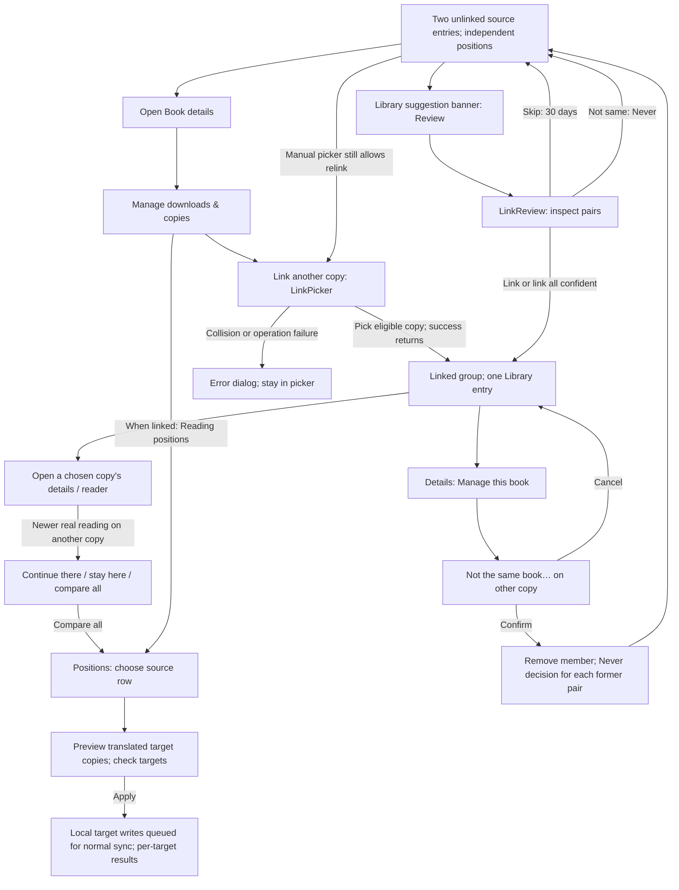

# Remaining screens — investigation report

2026-10-05. Current checkout, not a proposed visual design. Part B changes no application code.
“Code finding” below means verified by reading the implementation, not reproduced on a device.

## Scope, evidence and screenshot coverage

The requested `docs/superpowers/plans/2026-10-01-one-book-many-copies.md` does not exist.
The available documents are `2026-09-30-one-book-many-copies.md` and
`2026-10-01-one-book-many-copies-handoff.md` in that directory. The first describes device/Parrot
library identity; cross-server links and position translation are subsequent features already
present in code. The handoff is historical, not an accurate statement of today's build status.
Similarly, `design/BOOK_DETAILS_REPORT.md` predates the current Book details redesign; this report
uses the current split `detail/Book*.kt` files instead.

Actual PNG screenshots are in [`screens/`](screens/). Captured from installed Parrot on the POCO
phone (1280 × 2772), using the app's Day and E-ink settings, **not grayscale conversions**.
The installed app was not replaced with a new build. Theme was restored to Night afterward.
No links, reading positions, favourites, files or server configuration were changed for captures.
The available profile lists three local books, no series, no other-source candidates and no
suggestions. USB disconnected during capture; VPN ADB and a user unlock allowed capture to resume.

| Screen/component | Day | E-ink / other state | Coverage limit |
|---|---|---|---|
| SeriesListScreen | [Empty](screens/series-list-day.png), [search expanded](screens/series-list-day-search.png) | [Empty](screens/series-list-eink.png) | No populated series in this profile. |
| SeriesDetailScreen | Not captured | Not captured | No series to open; no supported detail deep link. |
| PositionsScreen | Not captured | Not captured | Requires linked copies; none available. |
| LinkReviewScreen | Not captured | Not captured | Entry banner requires suggestions; none available. |
| LinkedCopiesSection | Not captured | Not captured | No callers in current code; cannot navigate to it. |
| LinkPickerScreen | [Empty](screens/link-picker-day.png), [search](screens/link-picker-day-search.png) | [Empty](screens/link-picker-eink.png) | No eligible copies; blank body is the actual empty state. |
| Current replacement: BookManageSheet | [Unlinked local book](screens/manage-copies-day.png) | [Unlinked local book](screens/manage-copies-eink.png) | Demonstrates the real entry point replacing LinkedCopiesSection. |
| AuthorsListScreen | Not captured | Not captured | Route disabled. |
| AuthorDetailScreen | Not captured | Not captured | Route disabled. |

**Screenshot requirement remains incomplete:** these are not 2–3 captures of every requested
screen or of populated main states. Capturing the missing states requires an existing test profile
with Storyteller/ABS books, series and links; disabled/unused composables need a preview/test harness
or route restoration. Neither fake screenshots nor application changes were used to fill gaps.

### Source map

Paths below are relative to the repository root. Unless otherwise specified, UI files are under
`feature/books/ui/src/commonMain/kotlin/com/retro99/books/ui/`, domain files under
`feature/books/domain/src/commonMain/kotlin/com/retro99/books/domain/`, and reader-domain files under
`feature/reader/domain/src/commonMain/kotlin/com/retro99/reader/domain/`.

| Area | Principal implementation |
|---|---|
| Series | `series/SeriesListScreen.kt`, `SeriesListViewModel.kt`, `model/SeriesListUiModelMapper.kt`; `series/detail/SeriesDetailScreen.kt`, `SeriesDetailViewModel.kt`, `SeriesDetailViewState.kt`; domain `usecase/GetSeriesUseCase.kt`, `GetBooksBySeriesUseCase.kt` |
| Authors | `authors/AuthorsListScreen.kt`, `AuthorsListViewModel.kt`; `authors/detail/AuthorDetailScreen.kt`, `AuthorDetailViewModel.kt`; domain `usecase/GetAuthorsUseCase.kt`, `GetBooksByAuthorUseCase.kt`, `model/ServerBookMapper.kt` |
| Links | `links/LinkPickerScreen.kt`, `LinkReviewScreen.kt`, their ViewModels/states, `LinkedCopiesSection.kt`; domain `model/links/*.kt`, `usecase/GetBooksUseCase.kt`; data `feature/books/data/.../links/BookLinksDataRepository.kt` |
| Positions | `positions/PositionsScreen.kt`, `PositionsViewModel.kt`; reader-domain `usecase/ObserveCopyPositionsUseCase.kt`, `PreviewApplyPositionUseCase.kt`, `ApplyPositionUseCase.kt`, `FindLinkedResumeUseCase.kt`, `PropagateToLinkedCopiesUseCase.kt`, `TranslatePositionUseCase.kt`, `write/WriteCopyPositionUseCase.kt` |
| Current detail integration | `detail/BookLocationsCard.kt`, `BookManageSheet.kt`, `BookDetailProgress.kt`, `BookDetailHeader.kt`, `BookDetailDialogs.kt`, `BookDetailViewModel.kt` |
| Navigation | `feature/home/ui/src/commonMain/kotlin/com/retro99/home/ui/navigation/{HomeDestination,HomeTab,HomeNavigation,HomeNavigationStateHolder,HomeNavigationViewModel}.kt` |

## 1. Series

### SeriesListScreen — what is there today

The home-module screen is only a wrapper around the books-module screen.

- Each card shows **series name**, cover (first book in numeric series order), book count if above
  zero, chevron, and a star/“Featured” label when the server's `featured` value is positive.
  Missing covers get a collection/star placeholder. Featured is metadata, **not a favourite action**.
- No authors, source/server label, book order numbers, per-book progress or total series progress.
  Count is the number of available book entries matched by name, not a catalogue's promised total.
- Fixed alphabetical order by lowercased series name. No user-selectable sort, source filter,
  downloaded filter, reading-status filter or favourite filter.
- Actions: open a series detail, expand search, type a case-insensitive series-name substring,
  clear the field, close search (also clears query), pull to refresh when the list is nonempty.
- Initial loading uses `LoadingScreen`. Empty library and no search matches share **“No Series
  Found / Series will appear here once available”**; no contextual explanation or add/connect action.
- Errors are stored/logged but not rendered. `GetSeriesUseCase` converts each failed source to an
  empty list and returns success for the aggregate; a failed server can look like absent series.
  A later failure can leave existing cards visible. Empty-state UI has no pull-to-refresh wrapper.

### SeriesDetailScreen — what is there today

- Top bar: series name, Back, search toggle. Each book uses `BookItemCard`: cover, title, joined
  author names, available formats and source/home text, favourite heart; optional **position in
  this series** above the title. The matching membership is found by case-insensitive series name,
  not the route UUID. Source here is a home label, not necessarily a specific server hostname.
- **No per-book progress is supplied**: `BookItemCard` supports progress, but this call leaves
  `progressInfo = null`. Server cached-download information is also not supplied. No total
  series progress, overall completion count, series author summary or displayed detail book count.
- Fixed order: membership number ascending, then title. Unnumbered books go last
  (`Double.MAX_VALUE`); fractional numbers are supported. No reverse-order or alternate sort.
- Actions: Back; search/clear/close search; title-or-author substring filtering; pull to refresh;
  open **Book details**, not directly the reader; favourite/unfavourite each book.
- **Absent actions:** download all, mark one/all read, favourite series, edit series, reorder books,
  add/remove membership. Download/open media remain actions on Book details, not this screen.
- Loading replaces the content, including the detail top bar. Empty/no matches/error result in
  an empty list under the top bar, with no dedicated empty/error/retry message. Refresh is still
  structurally available. Favourite failures are not surfaced by the ViewModel.

### Origin, identity and editability

1. **Storyteller:** `lib/server-storyteller/.../StorytellerSeriesRepository.kt` fetches
   `/api/v2/series`; book metadata supplies memberships and sequence numbers.
2. **Audiobookshelf:** `lib/server-audiobookshelf/.../AudiobookshelfSeriesRepository.kt` fetches
   `/api/libraries`, then `/api/libraries/{id}/series?limit=0`. Books supply `metadata.series`;
   sequence text is parsed as a float, so nonnumeric values become “no number”.
3. **Imported files / Parrot library:** `LocalSeriesRepository` returns empty;
   `LibraryBook.series` is empty. File series metadata does not currently populate Browse.
4. **User-created:** no app series creation/editing/membership API or UI in this flow.
   Upstream edits must happen outside Parrot. Series fetching is read-only.

`GetSeriesUseCase` concatenates source lists without deduplication and drops provenance from
`SeriesDomainModel`. `SeriesListUiModelMapper` computes count/cover from **all ungrouped copies**
having that name; `GetBooksBySeriesUseCase` likewise filters ungrouped server books by name.
`StorytellerBook` is the domain type for both Storyteller and ABS here; that type filter does not
exclude ABS. A library copy is excluded even if linked to a server copy in the series.

Consequences:

- Same-named series on two servers can produce two cards, both opening the same cross-source
  book list and showing the same combined count. This is not deliberate canonical series identity.
- Linked copies can appear separately/count twice in series even though Library groups them.
- Books in several series appear in each matching detail; each detail uses its own membership
  number. Book details renders a separate entry for every membership. Memberships are not merged.
- Missing numbers are retained, placed last, with no number header; they are not inferred.
- UUID-only lazy-list keys on series/books can collide across servers; no source-qualified key.

### Code findings / usability gaps

- Refresh methods start new flow collectors instead of cancelling/replacing the previous one;
  `isRefreshing` is reset but never set true by these handlers. Refresh actually triggers a full
  loading state, not a well-represented background refresh.
- Series has explicit entrance/search animations even in E-ink, with no local motion guard.
- No distinction between “no upstream metadata”, “search found nothing”, “source offline” and
  “imported books cannot have series”. The live empty screenshot illustrates this ambiguity.

## 2. One book, many copies

### Plain-language explanation: two meanings of “copy”

A **book** is the thing you read. A **file copy** is a downloaded file on your phone or a stored
file in Parrot Cloud. Those are locations of **one library book**, sharing its stable book UUID;
you do not manually link your device download to its Parrot version. Ebook, audiobook and synced
read-aloud can be formats of that book, each with its own device/cloud file state.

A **source copy** is a separate entry for the same work in your library, Storyteller or ABS.
A **link** says “these entries represent the same book”. It groups them into one Library row and
lets Parrot compare/translate positions while preserving each source's book and files. It does
not upload, download, delete, replace or merge their upstream catalogue records.

Why link: an ebook imported on the phone and the same title's Storyteller narration/ABS audiobook
otherwise appear as separate books and resume independently. You can continue the wrong entry
at an old position and have to hunt for the matching chapter. Without the earlier device/Parrot
identity fix, even upload/restore could produce misleading “Local” entries, disconnected IDs and
incorrect deletion behaviour; those are **historical plan problems**, not all current bugs.
Cross-source duplicate entries and independent positions still occur **when not linked**.

### Model and limits

- Portable `CopyKey`: `library:<bookId>`, `storyteller:<uuid>`, `audiobookshelf:<itemId>`.
  It deliberately does not contain a device-specific server configuration ID.
- A copy belongs to at most one link; a link holds at most one member **per source type**.
  Two different Storyteller servers do not count as two different allowed sources. Maximum today
  is library + Storyteller + ABS, not an arbitrary number of editions or files.
- Linking can merge existing groups; the older link ID survives. A same-source collision is
  rejected even if the two clicked entries themselves have different sources.
- Changes are local DB transactions plus sync-outbox entries; Parrot Cloud sync distributes
  them when an account is active. Missing/unconfigured source members are omitted from visible
  linked-copy lists, not shown as disabled “missing copy” rows.

### Screen inventory: entry, data, all actions and states

#### LinkPickerScreen

**Entry:** Book details → locations card → **Manage downloads & copies** → **Link another copy…**
(`OnSameBookAsClicked`). The old section called this “Same book as…”. Route carries current
`serverId` and `bookUuid`; no public deep link exists for it.

**Data:** books on other source types, excluding the current group members; one candidate per
portable copy key. Rows have cover, title, authors, format/home line and query highlighting.
No favourite control, progress data or “match score”. Initial order comes from the alphabetically
sorted raw books list. Search is always drawn; `isVisible = false` suppresses autofocus, not the field.

**Actions:** Back; type/clear title-or-author search; choose a row. Choosing **immediately links**
and returns to the previous screen, without a second confirmation or position-selection step.

**States:** initial loading; candidates; filtered candidates; blank body for no candidates/no
matches/missing current book/load failure; same-source or general link-error dialog with OK and
dismiss. Candidate loading failures become empty lists. No refresh/retry/empty explanation,
link-in-flight indicator or disabled row protection. Manual picker ignores Never/Skip decisions,
so it is the way to intentionally relink a previously rejected pair.

#### LinkReviewScreen

**Entry:** Library's `LinkSuggestionsBanner` → **Review**; banner appears only when suggestions
exist. Route `HomeDestination.LinkReview` is otherwise registered but has no global menu entry.

**Data:** suggested pairs, each book's title/authors/home badge, reason (“matching identifier” or
title/author match). No covers, progress comparison, format picker or navigation into a candidate.
Pairs are sorted by score then pair key; score itself is not displayed. If score ≥90, a
**Link all N confident matches** button appears.

**Actions:** Back; Link pair; **Not the same book** (permanent Never decision); **Skip** (hidden
for 30 days); bulk-link confident pairs; dismiss/OK message dialog. Linking a single pair leaves
the screen open; observation removes handled suggestions. No reject/skip confirmation.

**States:** loading; list with/without bulk button; empty blank list after completion; same-source
error; general operation error; bulk-result count dialog. No “all done” state, refresh, operation
spinner or retry action. Bulk linking is sequential and may partly succeed: later merges can
conflict with sources already claimed; failed pairs are not counted, only success count is shown.

Suggestions normalize titles, accents, punctuation, common numbering and author “Last, First”
forms; compare best author pairs; use ISBN/ASIN intersection; reject known language mismatches.
Never and recent Skip hide pairs. **Confident is a heuristic**, not proof of identical editions:
missing author data can permit strong title-only matches; identifier validation is limited.
None are silently linked by the suggestion engine.

#### LinkedCopiesSection (legacy, unused)

**Entry:** none in current app. Repository search finds only its declaration. It is not the
current Book details “copies” UI.

**Data/states:** with members, “Also in” plus one home badge and all available format names per
copy; no cover, title, hostname, progress or download state. With no members, only **Same book as…**.
No loading, pending-operation, empty guidance or error state of its own.

**Actions:** Open (callback to that copy's Book details); Not the same book…; Same book as…;
separate `UnlinkCopyConfirmationDialog` supports Cancel/dismiss/confirm and warns that the copy
becomes separate and will not be suggested again. The shared confirmation dialog remains used
by current Book details. Section callbacks delegate all effects to the caller.

#### PositionsScreen

**Entry:** current management sheet → **Reading positions** (only when linked copies exist), or
**Compare all** in a linked-resume prompt from Book details/reader. Comparison is not an answer to
the prompt and does not open the reader. Route carries server/book identity.

**Data:** one position row per available linked copy, including self; **two rows for a copy** if
its local and remote positions disagree. Rows show home plus a inferred format label, chapter and
percent for text, whole-book audio time/length and percent when known, otherwise “About N%”; device
name; relative observation time and origin (this device/server/set from another copy/restored/
unknown); Latest, stale-fetch warning; optional text excerpt. No-position rows show copy identity
without a position/action. Labels infer one format from availability, not a per-format history.

**Actions:** Back; select/unselect row; selected nonempty row reveals **Use this position**;
open apply preview; tick/untick target copies; Apply; dismiss preview sheet. It does not open
books, download files, link/unlink, choose a permanent primary or provide a separate per-format
selector. No pull-to-refresh.

**Preview states:** exact/high-confidence targets are prechecked; approximate translations and
start/end-collapse warnings are unchecked; unsupported/no-translation targets are disabled.
Shows “same place” or “about N%”, target labels and warnings. Apply is disabled with no selected
targets or while applying. Results show success/failure target names (partial success possible).
Rows reload after applying; sheet stays open and can be dismissed or Apply pressed again.

**Other states:** loading; ordinary list; local/server conflict candidates; stale last-known
server positions after a bounded fetch (~2 seconds); no position/excerpt; blank list if no longer
linked. No explicit top-level fetch error, no empty message and no in-sheet progress text.
`ObserveCopyPositionsUseCase` is a suspend snapshot despite its name, not a continuously observed
Flow. The ViewModel reloads on entry/after apply, not as other devices keep reading.

### Full flow (including undo)

Unlinking two members dissolves the group. With three, the two remaining members stay linked.
Unlink does **not** delete files or undo positions already copied; it stops treating that member
as the same book. It is not a historical rollback. Manual relinking is possible, but there is no
UI to reset Never/Skip decisions as a separate operation.

### Decisions: what the user chooses vs what the app chooses

| Decision | Current implementation | Sensible automation boundary |
|---|---|---|
| Are these the same work? | User picks/approves; can bulk approve ≥90-score suggestions. | Suggest and rank automatically, not merge ambiguous editions silently. |
| Which copy is primary? | No primary selector. `choosePrimary` supports current reading → last opened → Parrot/device/Storyteller/ABS → stable key. `GetBooksUseCase` currently supplies only library last-open times, **not currentlyReading**. | Automatic recent-use default is sensible; UI should explain what Open will open. Helper capability is broader than this caller's actual inputs. |
| Which position wins? | Linking itself chooses **none**. Linked resume offers latest real reading, not furthest percent, with Continue/Stay/Compare. Manual panel lets user override. | Recent trustworthy reading can select an offer. Never assume 81% beats a deliberate reread at 30%. |
| Where does a chosen position go? | User checks target **copies**. Reliable previews default on; approximate/edge mappings need opt-in. | Exact/high defaults are already automatic. Preserve consent for uncertain mappings and overwrites. |
| Which format/file should open/download? | Details/manage sheet offers formats. No format-winner choices in LinkPicker/Review/Positions. | Pick a sensible available/downloaded format, retain explicit alternatives. Position translation may use downloaded text/SMIL or audiobook durations; missing files constrain accuracy. |

Automatic propagation is a separate, setting-gated feature: only real `User` reading positions,
Exact/High translations, not newer target reading, worthwhile movement (≥1% or ≥2000 text
characters), no repeated writes and no accidental jump to start/end. Backward reading is valid.
Manual apply writes now, bypasses the automatic movement threshold and never writes the source
copy. Both use `WriteCopyPositionUseCase`, local save plus normal source sync; “Applied” means
local write succeeded, **not a confirmed remote acknowledgement**. Neither invents reading sessions.

### Relationship to “Another device is at 81%” and Manage downloads & copies

These are related but different layers:

- **Book details conflict:** local vs remote position of the **same source copy**. If remote is
  further, a prominent card offers Go to N% / Keep mine. If remote is behind, a smaller hint/pill
  offers Use N%; long-press dismisses the hint. Conflict resolution is disabled in flight and
  failures show a snackbar. This UI is usable without cross-source linking.
- **Linked-resume prompt:** a newer reading observation on a **different linked source copy**,
  translated into the chosen copy. Offers Continue / Stay / Compare all. The reader's
  `linkedResumeResolved` route flag avoids asking again when details has already answered.
- **Positions:** the comprehensive comparison surface, including linked copies' own local/remote
  candidates. Overlaps with same-copy conflict **display**, but applies only to other copies.
  It is not a complete replacement for same-copy conflict resolution.
- **Management sheet:** physical availability and group membership, not position comparison.
  On-phone formats have Open/Remove/Download/Cancel; cloud transfer/add/remove actions depend on
  library/account state. “Same book elsewhere” shows linked copies, Open, Not the same book…,
  Reading positions, Link another copy…. It is the live gateway to all these flows.
- **Locations card:** repeats availability and linked-copy Open shortcuts inline, with a gateway
  to management. This is intentional summary/detail duplication. The old LinkedCopiesSection
  additionally duplicates linking controls **in source code only**, not in today's rendered screen.

### Confusing points and code-level bugs/risks

1. “Copy” means device/cloud file, external-source entry and sometimes a format. “Remove” can mean
   delete a download, delete cloud files, delete a device-only book or unlink identity; these must
   remain visibly distinct. Unlink is not delete and never resets prior propagated positions.
2. Picker title says “another server”, but library/Parrot count as one source and two servers of
   the same type cannot coexist in one group. Picker candidates don't prevalidate all merged-group
   source collisions; some visible choices can fail after tapping.
3. Picker/Review/Positions lack contextual empty states; picker swallows book loading failures.
   Screens have no in-flight link/decision affordance. Bulk review hides failure detail behind a
   linked-count summary. Unlink failure is logged without a user-facing failure state.
4. Choosing a local/server conflict candidate in Positions **cannot resolve that copy itself**:
   preview excludes every row whose copy key equals the source. With the other candidate also
   present, the user may expect “Use this” to reconcile it, but only other copies are targets.
5. Mixed-format copy labels infer read-aloud/ebook/audio from available media rather than the
   selected position's actual format; Positions also omits specific server hostnames. Legacy
   LinkedCopiesSection omits the linked book title entirely.
6. “Latest” is based on observed real reading, not visual progress. “Applied” is local success
   before queued sync; write failures/refusals are reduced to target-name summaries. Stale and
   missing data are not equivalent and need different explanations.
7. UUID-only position/favourite lookups and portable keys without server instance identity impose
   collision assumptions. Supporting two ABS/Storyteller instances is a model/identity project,
   not a layout-only redesign.
8. Positions still uses stock animated `ModalBottomSheet`; Series/Authors use local animations.
   Unlike current management's static E-ink dialog, they do not explicitly remove motion per mode.

## 3. Authors — returning through Browse, not the bottom bar

### Current screens and history

**AuthorsListScreen:** alphabetical list of name, optional distinct `fileAs` (“sort as” name),
generic person avatar and chevron. No book count, real portrait, biography, source, progress,
favourite, search or selectable sort/filter. Actions: open author; pull to refresh on populated
list. States: loading; cards; Ember “no authors” empty state; errors logged/stored but not rendered
(old list or empty state remains). Refresh creates another collector/full loading state, as Series
does. The home wrapper is still present; books UI/ViewModels and Koin annotations remain.

**AuthorDetailScreen:** author-name top bar and Back; alphabetically sorted book cards with cover,
title, joined series names, status chip when available and format icons. Actions: Back, refresh,
open Book details. Status chip's callback is empty, despite its button-like appearance. No author
biography, author-image/profile, book count, progress, source label, favourite control, search,
filter, download-all or mark-read. Loading replaces the whole detail content; empty/error render
blank lists, without explicit messages/retry. These cards are older custom `AuthorBookItem`s,
not the current shared library rows.

History evidence: commit **`daaec104` (2026-02-12), “refactor(home): Remove authors feature”**
comments out both `HomeDestination.AuthorsList` and `AuthorDetail`, the HomeNavigation entries,
and the `HomeTab.Authors` item. That bottom-bar item was the old entry point. The commit contains
no explanation of the product motivation; it proves deliberate navigation removal, **not** that
author data quality was the stated reason. Current HomeNavigation no longer registers these
entries. This is not a compile flag to toggle at runtime.

### Is the data reliable enough?

**Not for a unified author browser without data work.** Names are adequate as display metadata,
but not canonical identity.

- `AuthorsRemoteDataSource` still calls Storyteller `/api/v2/creators` on **every authenticated
  server**, without selecting a source-specific author adapter. ABS/local/Parrot do not implement
  this catalogue contract; errors are logged then folded into `Ok(combined)` with empty results.
  `AuthorsDataRepository` caches and sorts this older creator catalogue.
- Creator records expose UUID/name/fileAs, but `GetBooksUseCase` maps `ServerBook.authors`
  (strings) through `ServerBookMapper` into `PersonDomainModel(uuid = name, name = name)` and
  sets `creators = emptyList()`. `GetBooksByAuthorUseCase(authorUuid)` compares **UUIDs**, not
  names. A catalogue creator UUID therefore normally finds no books in this current path.
  This is a concrete re-enable blocker, not solved by uncommenting routes.
- Book UI mapping then drops even these synthetic IDs, retaining only `List<String>` names;
  Book details and library rows cannot currently navigate using a genuine author ID.
- “Brandon Sanderson” vs “Sanderson, Brandon” remain separate names/IDs. `fileAs` is only display
  text here. Link-suggestion normalization handles this pattern for book matching, **not author
  canonicalization**. Neither case/accent normalization nor alias reconciliation is used by Authors.
- Server book models support multiple author strings. ABS's current mapper instead passes
  `authorName` as one string; structured multiple authors can therefore be flattened. LibraryBook
  has a single `author` field; mapping takes `authors.firstOrNull()`. File/Parrot identity is not a
  multi-author catalogue. Splitting a string on commas would corrupt “Last, First” and coauthor names.
- `GetBooksByAuthorUseCase` excludes LibraryBook and disables linked grouping; even if IDs are
  fixed, imported/Parrot works would be missing and linked source copies could appear twice.
- No source qualification/deduplication in the legacy creator list; list keys use only UUID.
  Authors may be people, organizations or missing; “Unknown author” must not become one global person.

### Required work for the two decided entry points

**Decision accepted:** Authors returns, but **no Authors bottom-bar tab**. Existing Series tab
becomes **Browse**, with a **Series | Authors** segmented switch at the top.

#### (a) Author names on Book details and library rows → AuthorDetailScreen

1. Restore/register a serializable author-detail route and entry; add intents/navigation callbacks
   through BookDetailScreen/ViewModel/header and BooksList/shared row components. Current header
   exposes only an `onSeries` callback, and authors are plain joined Text; the row's whole-book click
   must remain independent from author-name clicks. Detail book clicks must retain `(serverId, uuid)`.
2. Carry structured author references into UI (`authorId`, display name, source references), not
   only strings. Provide one stable resolved ID used by list, row, route and detail-book query.
   Prefer a persistent app author ID with source-scoped aliases; at minimum scope source IDs by
   server/source and resolve names consistently. Display name/fileAs must not be the durable key.
   Preserve provenance so uncertain equal names are not silently merged.
3. Map Storyteller creator references, ABS structured authors and EPUB creators into book-author
   relationships; adapt cached/imported metadata and Parrot metadata for multiple authors.
   A catalogue adapter or a book-derived author index must share the same IDs as book membership.
4. With several authors, each displayed name needs its own destination. If rows abbreviate, offer
   an accessible author chooser / “N authors” expansion rather than selecting the first arbitrarily.
   Do not parse the comma-joined rendered text to recover people. Missing/unresolved names need an
   explicit non-clickable/fallback state, not a broken route.
5. Query author books via resolved IDs/aliases, including library works and defined linked-copy
   deduplication. Handle author removed/renamed/offline, loading/empty/error/retry, and Back returning
   to the originating library row or book detail with scroll/search preserved. Test coauthors,
   homonyms, aliases and source removal.

#### (b) Browse → Series | Authors

1. Add a Browse root/container with two children, reusing screen content but avoiding duplicated
   top insets. Author list callback opens registered AuthorDetail; both details open normal BookDetail.
   Do not uncomment `HomeTab.Authors` or add a fifth stack.
2. Save the selected segment, each list's scroll/search/filter state, and preserve it across tab
   switches/process recreation. Define root Back behaviour without pushing a navigation entry on
   every segment tap. Author details opened from Books stay on **Books' stack**, not forcibly Browse.
3. Fix data identity/query mismatches first. Re-enable the surviving Koin ViewModels, verify their
   injected callbacks, add current Ember styling/E-ink motion guards and meaningful states. Simply
   placing AuthorsListScreen in a segment would expose the old broken data path.

### Tab rename: deep links, saved state and analytics

| Concern | Impact / constraint |
|---|---|
| Display label only | Changing `HomeTab.Series.labelRes` to Browse is safe for route identity. Keep internal `HomeTab.Series` and `HomeDestination.SeriesList` if compatibility is the priority. |
| Public deep links | `DeepLinkHandler` only parses `parrot://reader?...`; no Series or Authors URI routes exist. A label-only rename doesn't change reader links. New author links would require a new parser/contract, not just restored NavKeys. |
| Saved tabs/routes | `HomeNavigationStateHolder` saves current tab and serializes per-tab destination lists with kotlinx.serialization. Renaming/removing enum/route symbols, changing serialized names or changing the root to a new incompatible type requires restoration compatibility/migration. No defensive decode fallback is visible in its saver. Segment selection needs new saved state. |
| Analytics | Tab handling derives the name from `intent.tab.name.lowercase()`; label-only Browse still emits `series`. Screen/discovery instrumentation separately uses `SeriesBrowsing`, `AuthorBrowsing`, `DiscoveryRoute.Series/Author`, and literal `series`/`authors` contexts. Decide whether historical tab identity stays `series` or gets an explicitly mapped `browse` value; update allowed values/dashboards/tests if changed. Preserve Series vs Authors discovery attribution within Browse. |

## 4. Most confusing issue and redesign constraints, by area

| Area | Most confusing today | Constraints the redesign must respect |
|---|---|---|
| **Series** | “What does this series represent?” Same-name source cards can open the same combined list; counts include raw copies, progress is absent and failures look empty. | Name matching currently bridges inconsistent upstream IDs; don't lose multi-series/fractional/unnumbered memberships. Canonical identity, source attribution, linked deduplication and progress aggregation require domain work. Distinguish local-library limitations, no matches and offline sources; don't imply bulk actions exist. |
| **Copies / links / positions** | “Am I managing files, choosing a version or replacing my place?” Identity linking, delete/remove, same-copy conflict and cross-copy resume use overlapping language but have different effects. | Preserve stable library UUIDs, portable links and one-member-per-source limits unless deliberately migrated. Never delete files on unlink; never claim unlink undoes prior progress writes. Latest reading is not furthest progress. Keep uncertain translation consent, source exclusion, partial results, stale provenance, queued-sync semantics and loop/collapse/newer-reading guards. Don't redesign the unused section as if it is the live entry point. |
| **Authors** | “Why does this author have no books / appear twice?” The catalogue UUID and book author IDs disagree; aliases and flattened coauthors further fragment identity. | Authors returns through clickable names and the Browse segment, **not a bottom tab**. Fix structured membership/stable identity before routing; preserve coauthors and provenance, avoid name-only homonym merges. Keep caller-stack Back behaviour, saved-state compatibility and separate Series/Authors analytics. All three areas need accessible targets, clear empty/error states and genuine motion-free E-ink treatment. |
